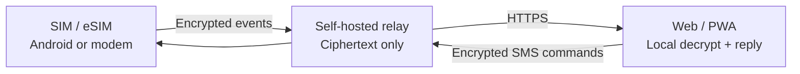

<div align="center">


# SIM Hub

**Turn Android phones and supported cellular modems into a private, self-hosted SMS and SIM hub.**

Multi-SIM messaging · OTP extraction · Encrypted relay · Web / PWA controller

[简体中文](README.zh-CN.md) · **English**

[](https://github.com/blackkcold/simhub/actions/workflows/ci.yml)
[](https://github.com/blackkcold/simhub/releases/latest)
[](LICENSE)

**[Download Android APK](https://github.com/blackkcold/simhub/releases/latest)** · **[Quick deployment](docs/QUICKSTART.zh-CN.md)** · [Installation guide](docs/INSTALLATION.md)

</div>

## Interface previews

**Web / PWA · Conversations and direct replies**


**Web / PWA · Devices, SIM identities and diagnostics**


<table>
<tr><th>Mobile Web / PWA</th><th>Native Android SIM Node</th></tr>
<tr><td width="50%"></td><td width="50%"></td></tr>
</table>

**Unfolded Android · Adaptive dual-pane SMS workspace**


<sub>Illustrative UI mockups using synthetic data; not screenshots from a live account or real messages.</sub>

## Features

| Capability | What it does |
|---|---|
| **SMS and OTP** | Multi-SIM receive/send, conversation replies, new messages, code detection and copy |
| **Native Android UI** | One Material 3 adaptive interface with foldable panes, SIM tags, messaging, all advanced tools and local diagnostics |
| **Devices and SIMs** | Android and Linux modem nodes; phone numbers, signal, charging, Wi-Fi and connectivity |
| **Shared SMS (opt-in)** | Authorized Android devices decrypt a common encrypted pool; latest 100, incremental/older pagination and masked SIM provenance |
| **History and diagnostics** | Latest 100 rescan, older 100 backfill, auto-loading Web inbox, device health and redacted diagnostics |
| **Pairing** | Scan the controller QR from Android, or enter the Android eight-digit pairing code and verify the device fingerprint |
| **Privacy and authentication** | Node-Key end-to-end encryption, username / TOTP / Passkeys, active Vault session recovery |
| **Offline resilience** | Durable queues, retries, foreground relay and scheduled background recovery |

Editable SVG icon sources are in [design/icons](design/icons); the APK uses matching Android VectorDrawables with automated parity checks.

## How it works



## Quick deployment

Requires **Linux + Docker Compose + Python 3**, two DNS names pointing to your server (for example `admin.example.com` and `node.example.com`), and inbound TCP **80/443**. Do **not** expose port **8787** publicly.

```bash
git clone https://github.com/blackkcold/simhub.git
cd simhub
python3 scripts/setup.py --admin-domain admin.example.com --node-domain node.example.com
```

The installer checks DNS / Docker / ports, creates the Admin Token, TOTP and owner-only `.env`, then starts Relay and Caddy HTTPS. **You must create DNS records at your provider.** For an existing Nginx / Caddy / Traefik proxy, add `--mode external` and configure dual-host TLS routing yourself.

Open the management URL, log in, create/import your local Vault, then install the signed Android APK, enroll by QR/code and configure SMS permissions and **default SMS app** access.

## Boundaries

The relay cannot read SMS or Vault plaintext; Passkeys authenticate users but do not replace Vault recovery keys. Default inactivity is **8 hours** with a **24-hour absolute session limit**; active same-tab refresh can restore the unlocked Vault. Android cellular fallback uses the **OS-configured default data SIM**—ordinary apps cannot force-switch it. **No phone calling; MMS media support remains limited.**

## Documentation

[Quick deployment](docs/QUICKSTART.zh-CN.md) · [Installation](docs/INSTALLATION.md) · [Android setup](docs/ANDROID_SETUP.md) · [Security](docs/SECURITY_ARCHITECTURE.md) · [Shared SMS](docs/SHARED_SMS.md) · [Architecture](docs/ARCHITECTURE.md) · [License](LICENSE)
