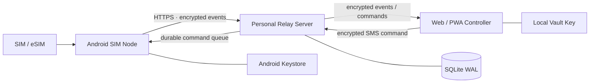

<div align="center">

# SIM Hub

**Turn an Android phone into a private, self-hosted SIM / SMS hub.**

Use your own server as an encrypted relay to remotely receive SMS, extract OTPs, manage multiple SIMs, and send SMS from a Web/PWA controller.

[简体中文](README.zh-CN.md) · **English**

[](https://github.com/blackkcold/simhub/actions/workflows/ci.yml)
[](https://github.com/blackkcold/simhub/releases/latest)
[](LICENSE)
[](docs/ANDROID_SETUP.md)
[](docs/DEPLOYMENT.md)

[Download latest release](https://github.com/blackkcold/simhub/releases/latest) · [Installation](docs/INSTALLATION.md) · [Architecture](docs/ARCHITECTURE.md) · [Security](docs/SECURITY_ARCHITECTURE.md)

</div>

---

## What is SIM Hub?

SIM Hub is a **personal, self-hosted remote SIM/SMS management system**.

One or more Android phones act as **SIM Nodes**. Your own server provides only the relay, queue and device-control plane. A Web/PWA controller decrypts and displays messages locally.

It is designed for use cases such as:

- keeping one or more physical SIM/eSIM cards online at home or in another location;
- remotely receiving SMS and OTP messages;
- copying verification codes from another device;
- sending SMS remotely through a selected SIM;
- monitoring SIM, carrier, signal, battery and device state;
- managing several Android SIM Nodes from one private control panel.

> **Scope:** SIM Hub is an SMS/SIM product. It intentionally does **not** implement phone calls, dialer replacement, call logs, cellular-call audio, SIP/WebRTC or PSTN bridging.

---

## Architecture



### Trust boundary

```text
Android SIM Node
  ├─ SMS / OTP / SIM state
  ├─ local durable queue
  └─ AES-256-GCM encryption
             │
             ▼
Personal Relay Server
  ├─ ciphertext
  ├─ routing metadata
  ├─ device / command state
  └─ NO Vault Key
             │
             ▼
Web / PWA Controller
  └─ local decrypt / search / copy / send
```

The relay is intentionally **blind to SMS plaintext**. The Vault Key is shared between the controller and Android node during enrollment and is not provided to the relay during normal operation.

---

## Features

| Area | Capability |
|---|---|
| **SMS** | Receive SMS, history sync, remote send, multipart handling |
| **OTP** | Local OTP detection; OTP value remains inside the encrypted payload |
| **Multi-SIM** | Dual-SIM/eSIM aware routing using Android `subscriptionId` |
| **Remote control** | Select device + SIM and send SMS from the PWA |
| **Devices** | Multiple Android nodes, aliases, groups and online state |
| **Telemetry** | Carrier, service state, signal, battery, charging, network and agent status |
| **Offline reliability** | Durable Android event queue + durable server command queue |
| **Security** | AES-256-GCM E2EE, per-device HKDF keys, Android Keystore, hashed device tokens, bound metadata, command expiry/idempotency |
| **Controller** | Installable PWA with inbox, OTP copy, search, send, devices, recovery import, SSE realtime updates and diagnostics |
| **Authentication** | High-entropy admin token + optional TOTP at login, then short-lived HttpOnly session |
| **Notifications** | Optional metadata-only webhook for Bark/ntfy/custom bridges |
| **Operations** | Docker deployment, health endpoint, audit log, backups, OTA metadata |

### Android compatibility

- **minSdk:** Android 10 / API 29
- **targetSdk / compileSdk:** Android 17 / API 37
- Designed to operate as the **default SMS app** for reliable arbitrary SMS/OTP handling on modern Android.
- Multi-SIM routing uses subscription IDs rather than fixed SIM1/SIM2 assumptions.

See [Compatibility](docs/COMPATIBILITY.md) for OEM/background considerations.

---

## Quick start

### 1. Deploy the relay

```bash
git clone https://github.com/blackkcold/simhub.git
cd simhub

cp .env.example .env
python3 scripts/gen_admin_token.py
```

Put the generated token into:

```env
SIMHUB_ADMIN_TOKEN=<your-random-token>
SIMHUB_PUBLIC_BASE_URL=https://simhub.example.com
```

Start the service:

```bash
docker compose up -d --build
curl http://127.0.0.1:8787/healthz
```

Expose the relay only through **HTTPS** using Caddy, Nginx or Traefik.

A ready-to-adapt Caddy example is included in [Caddyfile.example](Caddyfile.example).

### 2. Open the Web/PWA controller

Open your HTTPS SIM Hub URL in a modern browser.

Then:

1. enter the admin token;
2. optionally enter TOTP to create a short-lived HttpOnly browser session;
3. create, import, or unlock the local Vault;
4. create a one-time Android enrollment link.

### 3. Install the Android Agent

Download the latest APK from:

**[GitHub Releases →](https://github.com/blackkcold/simhub/releases/latest)**

For v0.1.5, the release workflow uses a stable release signing key when repository signing secrets are configured; otherwise the APK is explicitly published as **debug-signed**.

On the Android SIM Node:

1. install the APK;
2. open the enrollment link from the PWA;
3. enroll the device;
4. grant the requested SMS/SIM permissions;
5. set SIM Hub as the **default SMS app**;
6. optionally allow Contacts access;
7. enable the always-on relay mode if low-latency remote access is required.

Full procedure: [Installation Guide](docs/INSTALLATION.md).

---

## Installation and usage flow

### First-time setup

```text
1. Deploy Relay Server
        ↓
2. Configure HTTPS + SIMHUB_PUBLIC_BASE_URL
        ↓
3. Open Web/PWA Controller
        ↓
4. Create/unlock local Vault
        ↓
5. Generate one-time enrollment link
        ↓
6. Install Android Agent
        ↓
7. Enroll Android SIM Node
        ↓
8. Set SIM Hub as default SMS app
        ↓
9. Grant SMS/SIM permissions
        ↓
10. Enable always-on relay if required
```

After enrollment, the Android phone becomes a SIM Node and normally does not need to be operated directly. Keep it powered, connected to the network and able to receive cellular SMS.

### Receiving SMS / OTP

```text
Carrier sends SMS
    ↓
Android SIM Node receives and stores it
    ↓
OTP is detected locally when applicable
    ↓
Message payload is encrypted on Android
    ↓
Encrypted event is relayed through your server
    ↓
PWA fetches and decrypts it locally
    ↓
Read SMS / copy OTP
```

In daily use, open the PWA on your computer, tablet or another phone. New messages appear in the inbox after the Android node uploads them. OTP values can be copied directly from the controller.

### Sending SMS remotely

```text
PWA: choose Android device
    ↓
choose SIM / subscription
    ↓
enter recipient + message
    ↓
encrypt command locally
    ↓
Relay Server queues encrypted command
    ↓
Android SIM Node fetches command
    ↓
selected SIM sends the SMS
    ↓
result/status is reported back
```

The relay server does not need the plaintext SMS body to perform delivery.

### When the Android node is offline

Events and commands are persisted in queues rather than relying on a permanently alive WebSocket. When connectivity returns, the node retries synchronization. For the lowest latency, keep the Android Agent's always-on relay enabled and exempt it from aggressive OEM battery restrictions where necessary.

### Adding another SIM Node

Repeat the enrollment process for each additional Android phone. Each node receives its own device identity/token while sharing access to the same private controller vault. You can then select the target device and Android subscription from the PWA.

---

## Security model

SIM Hub handles SMS and OTP data as authentication-grade secrets.

Core security properties:

- SMS body, OTP, contact names and outbound SMS content are encrypted before reaching the relay.
- The relay does not store the Vault Key.
- Device bearer tokens are stored as hashes.
- Enrollment tokens are short-lived and single-use.
- Commands include expiry and idempotency protection.
- Sensitive SMS/OTP values are excluded from normal server logs and notification webhooks.
- Android keeps local cryptographic material protected by Android Keystore.
- TLS is required for public relay access.

For the full design and threat model:

- [Security Architecture](docs/SECURITY_ARCHITECTURE.md)
- [Threat Model](THREAT_MODEL.md)
- [Security Policy](SECURITY.md)

---

## Reliability model

SIM Hub does not assume that an Android background process or WebSocket will remain alive forever.

Instead:

```text
Incoming SMS
  → persist locally
  → encrypt
  → durable queue
  → upload when network is available

Remote command
  → persist on relay
  → Android fetches
  → validate expiry / idempotency
  → execute
  → report result
```

This allows the system to recover from temporary mobile-network loss, Wi-Fi changes, process restarts and relay outages without treating a single HTTP failure as lost business state.

---

### v0.1.5 reliability changes

- Event identity is scoped by device, so multiple Android nodes can safely have the same local SMS Provider ID.
- Remote commands are atomically claimed on Android and all sync entry points share one process-level coordinator.
- SMS history uses a `(date, providerId)` watermark and advances only after durable local queueing.
- SMS lifecycle states are tracked as `submitted → sent → delivered` or `failed`.
- New ciphertext uses per-device HKDF-derived AES-256-GCM keys with a `kid` and metadata-bound AAD; legacy v1 ciphertext remains readable.
- Admin Token + TOTP now create a short-lived HttpOnly browser session instead of reusing an old TOTP on every poll.
- PWA supports recovery-key import and SSE-driven realtime refresh with polling only as fallback.
- Fresh-message notification rules prevent history synchronization from flooding Bark/ntfy.
- Relay schema migrations, subscription projection, retention controls, metrics, online backup helper and rolling-upgrade compatibility are included.

---

## Current limitations

### No phone-call functionality

SIM Hub intentionally does not include:

- phone-call answering/rejection;
- remote dialing;
- call logs;
- cellular-call audio capture;
- SIP/RTP/WebRTC;
- PSTN media bridging.

### MMS

The project includes default-SMS eligibility and **MMS metadata/history observation**, but does not implement a complete carrier-specific MMS PDU download/send transport.

SMS and OTP are the supported production path.

### Release signing

Public release APKs may be debug-signed unless explicitly marked otherwise. For long-term personal deployment, build and sign the Android Agent with your own release key.

---

## Documentation

| Document | Purpose |
|---|---|
| [Installation](docs/INSTALLATION.md) | End-to-end server + PWA + Android setup |
| [Architecture](docs/ARCHITECTURE.md) | Components, trust boundary and data flow |
| [Android Setup](docs/ANDROID_SETUP.md) | Android build and device requirements |
| [Relay Server](docs/SERVER.md) | Server runtime, configuration and responsibilities |
| [Deployment](docs/DEPLOYMENT.md) | Docker, HTTPS, backup and OTA deployment |
| [Protocol](docs/PROTOCOL.md) | Enrollment, event and command protocol |
| [Security Architecture](docs/SECURITY_ARCHITECTURE.md) | Encryption and trust model |
| [Compatibility](docs/COMPATIBILITY.md) | Android/OEM behavior and test notes |

---

## Build from source

### Server

The relay is intentionally lightweight and uses Python's standard library + SQLite.

```bash
export SIMHUB_ADMIN_TOKEN="$(python3 scripts/gen_admin_token.py --raw)"
export SIMHUB_DB=/tmp/simhub.db
python3 server/simhub_server.py
```

### Android

Requirements:

- JDK 17
- Android SDK Platform 37
- Gradle 9.6+

```bash
cd android
gradle :app:assembleDebug
```

CI also performs a complete API 37 debug APK build.

---

## Release

Current release:

**[v0.1.5 — Reliability & Security](https://github.com/blackkcold/simhub/releases/tag/v0.1.5)**

Release assets include the Android APK, tagged source snapshot, documentation bundle and SHA-256 checksums.

---

## License

SIM Hub is released under the [MIT License](LICENSE).

See [THIRD_PARTY_NOTICES.md](THIRD_PARTY_NOTICES.md) for platform/tooling notices.
