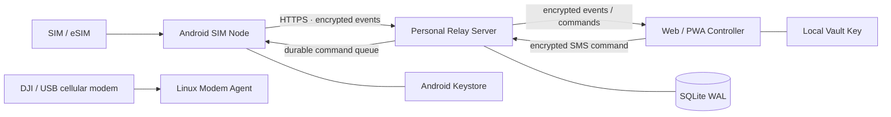

<div align="center">


# SIM Hub

**Turn Android phones and supported cellular modems into a private, self-hosted SIM / SMS hub.**

Use your own server as an encrypted relay to remotely receive SMS, extract OTPs, manage multiple SIMs, and send SMS from a Web/PWA controller.

[简体中文](README.zh-CN.md) · **English**

[](https://github.com/blackkcold/simhub/actions/workflows/ci.yml)
[](https://github.com/blackkcold/simhub/releases/latest)
[](LICENSE)
[](docs/ANDROID_SETUP.md)
[](docs/DEPLOYMENT.md)

[Download latest release](https://github.com/blackkcold/simhub/releases/latest) · [Installation](docs/INSTALLATION.md) · [Architecture](docs/ARCHITECTURE.md) · [Security](docs/SECURITY_ARCHITECTURE.md)

</div>

---

## Interface preview

The Web controller adapts to desktop and mobile screens; the Android SIM Node uses a native interface. Both share the SIM Hub identity, with light and dark appearance support.

> **Preview note:** These are **illustrative representations** based on the current UI layout, using synthetic, redacted demo content. They are not screenshots from a logged-in server or evidence of hardware testing. Actual screens vary by device, locale and data.

**Web / PWA · Desktop**

<p align="center"></p>

<table>
<tr><th>Web / PWA · Mobile</th><th>Android SIM Node · Native UI</th></tr>
<tr><td width="50%"></td><td width="50%"></td></tr>
</table>

**Get started:** [Download the APK](https://github.com/blackkcold/simhub/releases/latest) → [Deploy your relay](docs/DEPLOYMENT.md) → [Open the HTTPS controller and enroll a SIM Node](docs/INSTALLATION.md). Branding sources and design tokens: [Design System](docs/DESIGN_SYSTEM.md).

---

## What is SIM Hub?

SIM Hub is a **personal, self-hosted remote SIM/SMS management system**.

Android phones and supported Linux cellular modems act as **SIM Nodes**. Your own server provides only the relay, durable queue and device-control plane. A Web/PWA controller decrypts and displays messages locally.

It is designed for use cases such as:

- keeping one or more physical SIM/eSIM cards online at home or in another location;
- remotely receiving SMS and OTP messages;
- copying verification codes from another device;
- sending SMS remotely through a selected SIM;
- monitoring SIM, carrier, signal, battery and device state;
- managing several Android and Linux/DJI modem SIM Nodes from one private control panel.

> **Scope:** SIM Hub is an SMS/SIM product. It intentionally does **not** implement phone calls, dialer replacement, call logs, cellular-call audio, SIP/WebRTC or PSTN bridging.

---

## Architecture



### Trust boundary

```text
Android SIM Node
  ├─ SMS / OTP / SIM state
  ├─ local durable queue
  └─ AES-256-GCM encryption
             │
             ▼
Personal Relay Server
  ├─ ciphertext
  ├─ routing metadata
  ├─ device / command state
  └─ NO Vault Key
             │
             ▼
Web / PWA Controller
  └─ local decrypt / search / copy / send
```

The relay is intentionally **blind to SMS plaintext**. New nodes receive a random independent Node Key; the Master Vault Key stays in the controller. The relay stores only a Master-wrapped Node Key envelope plus ciphertext/routing metadata. Legacy v0.1.5 nodes can rotate online to independent Node Keys.

---

## v0.5.0 notes

- Session and Vault share an eight-hour idle deadline; active tab refresh restores encrypted Vault session state after verifying the administrator cookie.
- Node-Key-encrypted SIM phone numbers appear in controller devices and message lists; browser-local encrypted overrides handle unknown numbers.
- Distinct latest-100 rescan and older-100 backfill controls with encrypted diagnostics.
- Android OS handles mobile data fallback using the system-default SIM; changing the default SIM requires Android system setup.

## Features

| Area | Capability |
|---|---|
| **SMS** | Receive SMS, history sync, remote send, multipart handling |
| **OTP** | Local OTP detection; OTP value remains inside the encrypted payload |
| **Multi-SIM / modem** | Stable `channelId + revision` routing across Android subscriptions and Linux/DJI modem channels |
| **Remote control** | Select device + SIM and send SMS from the PWA |
| **Devices** | Multiple Android and Linux/modem nodes, aliases, groups and online state |
| **Telemetry** | Carrier, service state, signal, battery, charging, network and agent status |
| **Offline reliability** | Durable Android event queue + durable server command queue |
| **Security** | AES-256-GCM E2EE, independent Node Keys, Android Keystore/local protected modem config, metadata-bound AAD, two-phase rotating bearer tokens |
| **Controller** | Installable PWA with inbox, OTP copy, search, send, devices, recovery import, SSE realtime updates and diagnostics |
| **Localized UI** | Android + Web/PWA support Simplified Chinese and English; Android also follows the system language and has responsive foldable/tablet layouts |
| **Developer diagnostics** | Opt-in Android diagnostic logging with automatic secret/SMS/OTP redaction, rotating local logs and ZIP export |
| **Authentication** | High-entropy admin token + optional TOTP at login, then short-lived HttpOnly session |
| **Notifications** | Optional metadata-only webhook for Bark/ntfy/custom bridges |
| **Operations** | Docker deployment, health endpoint, audit log, backups, OTA metadata |

### Android compatibility

- **minSdk:** Android 10 / API 29
- **targetSdk / compileSdk:** Android 17 / API 37
- Designed to operate as the **default SMS app** for reliable arbitrary SMS/OTP handling on modern Android.
- Remote SMS routing uses stable Channel IDs and revisions. Android `subscriptionId` is only a local adapter identifier and stale commands are rejected after SIM replacement.

See [Compatibility](docs/COMPATIBILITY.md) for OEM/background considerations.

---

## Quick start

### 1. Deploy the relay

```bash
git clone https://github.com/blackkcold/simhub.git
cd simhub

cp .env.example .env
python3 scripts/gen_admin_token.py
python3 scripts/gen_totp_secret.py
```

Put the generated token into:

```env
SIMHUB_ADMIN_TOKEN=<your-random-token>
SIMHUB_REQUIRE_TOTP=true
SIMHUB_TOTP_SECRET=<your-base32-secret>
SIMHUB_PUBLIC_BASE_URL=https://simhub.example.com
```

Start the service:

```bash
docker compose up -d --build
curl http://127.0.0.1:8787/healthz
```

Expose the relay only through **HTTPS** using Caddy, Nginx or Traefik.

A ready-to-adapt Caddy example is included in [Caddyfile.example](Caddyfile.example).

### 2. Open the Web/PWA controller

Open your HTTPS SIM Hub URL in a modern browser.

The controller follows the browser language on first use and can switch between **简体中文 / English** from the UI. Contextual `ⓘ` help explains security-sensitive options.

Then:

1. enter the admin token;
2. optionally enter TOTP to create a short-lived HttpOnly browser session;
3. create, import, or unlock the local Vault;
4. create an Android deep-link or Linux/DJI modem enrollment package.

### 3. Install the Android Agent

Download the latest APK from:

**[GitHub Releases →](https://github.com/blackkcold/simhub/releases/latest)**

Starting with v0.2.1, GitHub Releases publish only the **release-signed APK**. Missing signing secrets or a certificate fingerprint mismatch fails the release instead of falling back to a debug build.

On the Android SIM Node:

1. install the APK;
2. open the enrollment link from the PWA;
3. enroll the device;
4. grant the requested SMS/SIM permissions;
5. set SIM Hub as the **default SMS app**;
6. optionally allow Contacts access;
7. enable the always-on relay mode if low-latency remote access is required.

Full procedure: [Installation Guide](docs/INSTALLATION.md). For troubleshooting, see [Android developer diagnostics](docs/DEVELOPER_DIAGNOSTICS.md).

---

## Installation and usage flow

### First-time setup

```text
1. Deploy Relay Server
        ↓
2. Configure HTTPS + SIMHUB_PUBLIC_BASE_URL
        ↓
3. Open Web/PWA Controller
        ↓
4. Create/unlock local Vault
        ↓
5. Generate a one-time bootstrap enrollment link
        ↓
6. Install Android Agent
        ↓
7. Enroll Android SIM Node
        ↓
8. Set SIM Hub as default SMS app
        ↓
9. Grant SMS/SIM permissions
        ↓
10. Enable always-on relay if required
```

After enrollment, the Android phone becomes a SIM Node and normally does not need to be operated directly. Keep it powered, connected to the network and able to receive cellular SMS.

### Receiving SMS / OTP

```text
Carrier sends SMS
    ↓
Android SIM Node receives and stores it
    ↓
OTP is detected locally when applicable
    ↓
Message payload is encrypted on Android
    ↓
Encrypted event is relayed through your server
    ↓
PWA fetches and decrypts it locally
    ↓
Read SMS / copy OTP
```

In daily use, open the PWA on your computer, tablet or another phone. New messages appear in the inbox after the Android node uploads them. OTP values can be copied directly from the controller.

### Sending SMS remotely

```text
PWA: choose node
    ↓
choose SIM / subscription
    ↓
enter recipient + message
    ↓
encrypt command locally
    ↓
Relay Server queues encrypted command
    ↓
Android / Modem Node fetches command
    ↓
selected Channel sends the SMS
    ↓
result/status is reported back
```

The relay server does not need the plaintext SMS body to perform delivery.

### When the Android node is offline

Events and commands are persisted in queues rather than relying on a permanently alive WebSocket. When connectivity returns, the node retries synchronization. For the lowest latency, keep the Android Agent's always-on relay enabled and exempt it from aggressive OEM battery restrictions where necessary.

### Adding another SIM Node

Repeat enrollment for each Android or Linux modem node. Each node receives its own identity, bearer token and independent Node Key. The PWA selects a generic SMS Channel, so Android subscriptions and DJI/USB modem SIMs share the same inbox/send workflow.

---

## Linux / DJI modem node

A Linux Modem Agent is included under `modem_agent/`. It supports direct Quectel AT serial control for first-generation DJI/QDC507-style hardware and a generic ModemManager/`mmcli` path. The agent provides durable local queues, SMS receive/send, radio metrics, SIM-change channel revisions and the same E2EE protocol used by Android.

Create a **Linux / DJI Modem Node** enrollment package in the PWA, then follow `modem_agent/README.md`. DJI Cellular Dongle 2 is capability-gated rather than assumed compatible; use ModemManager detection first.

---

## Security model

SIM Hub handles SMS and OTP data as authentication-grade secrets.

Core security properties:

- SMS body, OTP, contact names and outbound SMS content are encrypted before reaching the relay.
- The relay does not store the Vault Key.
- Device bearer tokens are stored as hashes.
- Enrollment tokens are short-lived and single-use.
- Commands include expiry and idempotency protection.
- Sensitive SMS/OTP values are excluded from normal server logs and notification webhooks.
- Android keeps local cryptographic material protected by Android Keystore.
- TLS is required for public relay access.

For the full design and threat model:

- [Security Architecture](docs/SECURITY_ARCHITECTURE.md)
- [Threat Model](THREAT_MODEL.md)
- [Security Policy](SECURITY.md)

---

## Reliability model

SIM Hub does not assume that an Android background process or WebSocket will remain alive forever.

Instead:

```text
Incoming SMS
  → persist locally
  → encrypt
  → durable queue
  → upload when network is available

Remote command
  → persist on relay
  → Android fetches
  → validate expiry / idempotency
  → execute
  → report result
```

This allows the system to recover from temporary mobile-network loss, Wi-Fi changes, process restarts and relay outages without treating a single HTTP failure as lost business state.

---

### v0.2.1 production hardening

- Independent per-node content keys; the Master Vault Key no longer leaves the controller for new nodes.
- Generic Node + Channel model for Android and Linux/DJI modem nodes.
- Automatic SMS Provider reconciliation after live-receiver queue failures.
- Shared Android executors, cancellable JobService work and stale callback cleanup.
- Per-part SMS sent/delivery tracking with failure result codes.
- Stable channel identity/revision checks before remote SMS send.
- Linux Modem Agent with ModemManager and direct DJI/Quectel AT adapter paths, including durable multipart receive reassembly.
- Continuous retention/maintenance, trusted reverse-proxy client IP handling, readiness checks and Docker context hardening.
- Crash-safe two-phase device bearer-token rotation.
- Expanded server migration/maintenance/modem tests plus Android JVM tests.

### v0.1.5 reliability changes

- Event identity is scoped by device, so multiple Android nodes can safely have the same local SMS Provider ID.
- Remote commands are atomically claimed on Android and all sync entry points share one process-level coordinator.
- SMS history uses a `(date, providerId)` watermark and advances only after durable local queueing.
- SMS lifecycle states are tracked as `submitted → sent → delivered` or `failed`.
- New ciphertext uses per-device HKDF-derived AES-256-GCM keys with a `kid` and metadata-bound AAD; legacy v1 ciphertext remains readable.
- Admin Token + TOTP now create a short-lived HttpOnly browser session instead of reusing an old TOTP on every poll.
- PWA supports recovery-key import and SSE-driven realtime refresh with polling only as fallback.
- Fresh-message notification rules prevent history synchronization from flooding Bark/ntfy.
- Relay schema migrations, subscription projection, retention controls, metrics, online backup helper and rolling-upgrade compatibility are included.

---

## Release gates for unattended deployment

Software CI now validates relay migrations/maintenance, generic node/channel protocol, Modem Agent crypto/queue behavior, Web syntax, Android JVM OTP tests and an API 37 APK build. The following still require real hardware and are intentionally **not** represented as passed by CI:

- Android 17 default-SMS receive/OTP on a physical phone;
- Doze + OEM battery manager recovery after 24–72 hours;
- dual-SIM receive/send and physical SIM replacement revision handling;
- reboot/unlock/autostart behavior on target vivo/OPPO/Xiaomi/Huawei/HONOR ROMs;
- DJI Gen1/QDC507 physical SMS receive/send and modem storage cleanup;
- DJI Cellular Dongle 2 capability detection before enabling that hardware path.

See [Compatibility](docs/COMPATIBILITY.md).

---

## Current limitations

### No phone-call functionality

SIM Hub intentionally does not include:

- phone-call answering/rejection;
- remote dialing;
- call logs;
- cellular-call audio capture;
- SIP/RTP/WebRTC;
- PSTN media bridging.

### MMS

The project preserves encrypted MMS WAP PUSH evidence locally and warns the user, but does not implement full carrier-specific MMS media download/send. Do **not** use this as your primary messaging app if MMS is required.

SMS and OTP are the supported production path.

### Release signing

v0.2.1 and later release workflows require the pinned long-term signing identity. The release fails if signing secrets are absent or the certificate SHA-256 fingerprint does not match the documented identity.

---

## Documentation

| Document | Purpose |
|---|---|
| [Installation](docs/INSTALLATION.md) | End-to-end server + PWA + Android setup |
| [Architecture](docs/ARCHITECTURE.md) | Components, trust boundary and data flow |
| [Android Setup](docs/ANDROID_SETUP.md) | Android build and device requirements |
| [Relay Server](docs/SERVER.md) | Server runtime, configuration and responsibilities |
| [Deployment](docs/DEPLOYMENT.md) | Docker, HTTPS, backup and OTA deployment |
| [Protocol](docs/PROTOCOL.md) | Enrollment, event and command protocol |
| [Security Architecture](docs/SECURITY_ARCHITECTURE.md) | Encryption and trust model |
| [Compatibility](docs/COMPATIBILITY.md) | Android/OEM behavior and test notes |
| [Design System](docs/DESIGN_SYSTEM.md) | Brand assets, responsive UI and preview provenance |

---

## Build from source

### Server

The relay is intentionally lightweight and uses Python + SQLite and a WebAuthn verification dependency.

```bash
export SIMHUB_ADMIN_TOKEN="$(python3 scripts/gen_admin_token.py --raw)"
export SIMHUB_DB=/tmp/simhub.db
python3 server/simhub_server.py
```

### Android

Requirements:

- JDK 17
- Android SDK Platform 37
- Gradle 9.6+

```bash
cd android
gradle :app:assembleDebug
```

CI also performs a complete API 37 debug APK build.

---

## Release

Latest release:

**[Latest GitHub Release](https://github.com/blackkcold/simhub/releases/latest)**

Release assets include the Android APK, tagged source snapshot, documentation bundle and SHA-256 checksums.

---

## License

SIM Hub is released under the [MIT License](LICENSE).

See [THIRD_PARTY_NOTICES.md](THIRD_PARTY_NOTICES.md) for platform/tooling notices.

## Public controller security (v0.3.1)

For an Internet-facing installation, use distinct TLS hostnames for the management PWA and node API. Enable an identity-aware gateway on the management hostname, plus SIM Hub TOTP. The relay enforces CSRF, short-lived step-up verification, idle session expiry, bounded request resources and durable SMS send quotas. Follow [the hardening and migration guide](docs/PUBLIC_SECURITY_HARDENING.md) **before enabling strict origin separation** so existing nodes are not disconnected.


## Efficient SMS synchronization (v0.3.2)

- **First registration**: Android queues at most the **100 most recent SMS** (rather than processing thousands of older messages first).
- **New messages**: a separate date-and-Provider-ID cursor syncs subsequent SMS incrementally.
- **Older messages**: choose **Load 100 older SMS** in Android, or **Sync history** on an enrolled Web device. Each action queues at most 100 older SMS; repeat as needed.
- **Network**: batches of 20 encrypted events use atomic, idempotent confirmations. Failed and rate-limited uploads stay in local SQLite until acknowledged; 429 responses honor Retry-After.
- **Web controller**: opens with the most recent 30 server events, retrieves older records on demand, and keeps the inbox responsive during historical backfill.

**Upgrade order:** deploy the v0.3.2 Relay first, then upgrade Android Agents to v0.3.2. Older Android agents continue using the single-event endpoint. Existing Node Keys and SMS ciphertext require no reset. The Relay's configured event retention still applies, so historical server events may expire as designed.

## v0.4.0: Guided deployment, Passkeys and SMS conversations

For new Linux deployments run `python3 scripts/setup.py --admin-domain admin.example.com --node-domain node.example.com`. This configures DNS preflight and a managed Caddy HTTPS reverse proxy. Use `--mode external` for an existing proxy. See the [quick start](docs/QUICKSTART.zh-CN.md).

The Web Controller now provides administrator usernames, FIDO2/WebAuthn Passkey login and step-up, a single SMS inbox with direct reply, multi-SIM channel selection and a new-message button. Passkeys authenticate the administrator but **never decrypt or upload local Vault keys**. Keep recovery materials offline. Preserve existing `.env` and domain during upgrades; encrypted SMS and existing device protocols stay compatible.
