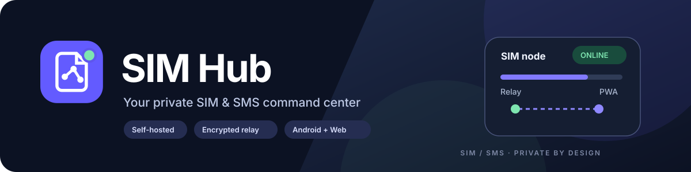
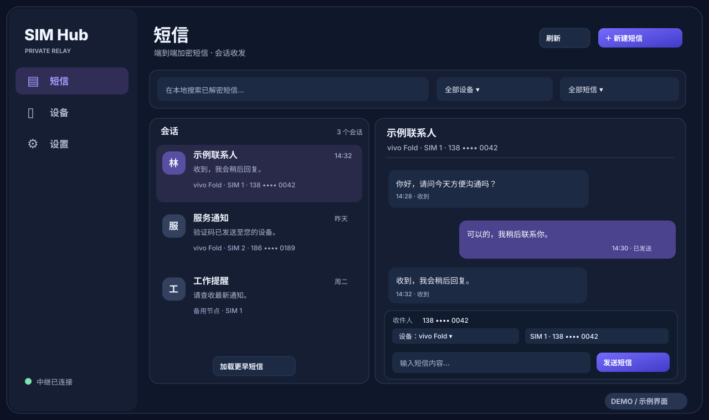
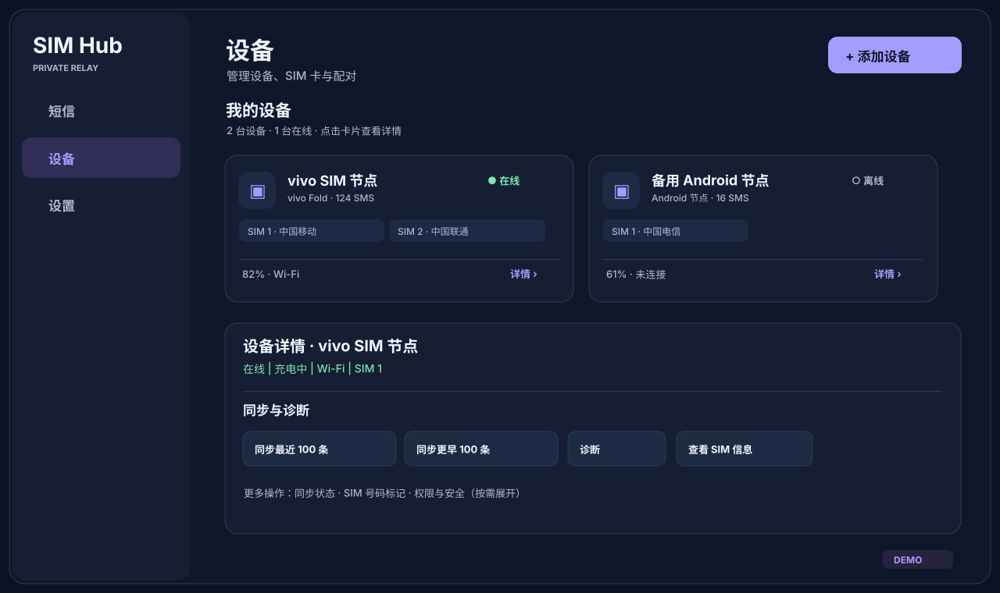
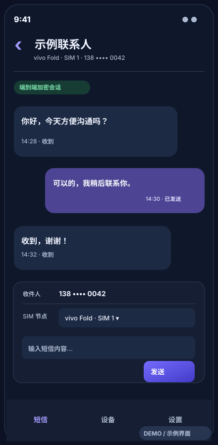
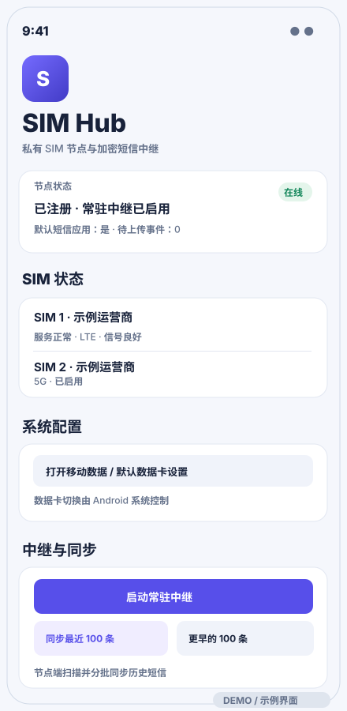
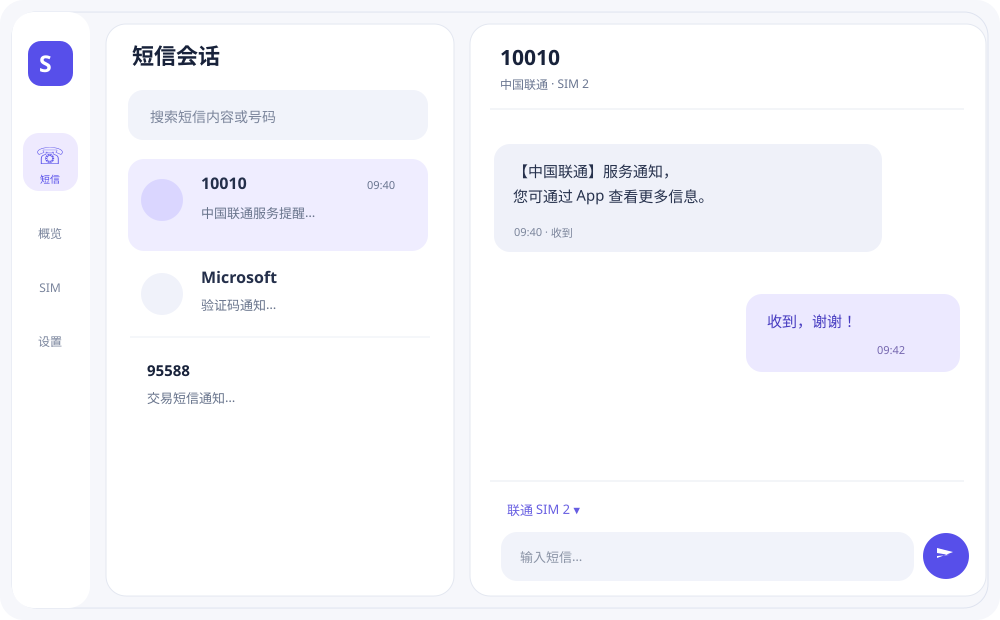
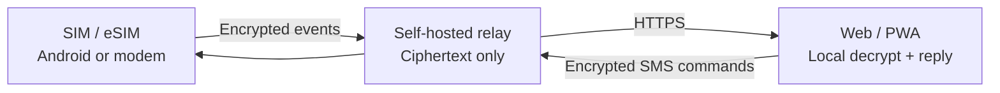

<div align="center">



# SIM Hub

**Turn Android phones and supported cellular modems into a private, self-hosted SMS and SIM hub.**

Multi-SIM messaging · OTP extraction · Encrypted relay · Web / PWA controller

[简体中文](README.zh-CN.md) · **English**

[](https://github.com/blackkcold/simhub/actions/workflows/ci.yml)
[](https://github.com/blackkcold/simhub/releases/latest)
[](LICENSE)

Android v0.13.1 fixes delayed SMS ingestion and queued remote commands, with adaptive Balanced command checks (45s interactive / 120s idle), accessible icon-based energy cards and safe manual retry diagnostics. Android release updates still work without pairing.

**[Download Android APK](https://github.com/blackkcold/simhub/releases/latest)** · **[Quick deployment](docs/QUICKSTART.zh-CN.md)** · [Installation guide](docs/INSTALLATION.md)

</div>

## Interface previews

**Web / PWA · Conversations and direct replies**



**Web / PWA · Devices, SIM identities and diagnostics**



<table>
<tr><th>Mobile Web / PWA</th><th>Native Android SIM Node</th></tr>
<tr><td width="50%"></td><td width="50%"></td></tr>
</table>

**Unfolded Android · Adaptive dual-pane SMS workspace**



<sub>Illustrative UI mockups using synthetic data; not screenshots from a live account or real messages.</sub>

## Updates (v0.9.1)

Web Settings offers GitHub Release checking, ignore and one-click deployment of **Sigstore-verified GHCR OCI digests**. Automatic updates require a dedicated Rootless Docker daemon, trusted Cosign CLI and one-time **non-root** enrollment (`bash scripts/install-updater.sh`); the retired root updater must be disabled explicitly. The Relay never receives a Docker socket. Each update backs up SQLite, validates readiness and restores the prior image on failure; schema migrations remain supervised. Android Settings can check, ignore and download signed APKs for user-approved installation. See [Rootless migration](docs/DEPLOYMENT.md) and [Android setup](docs/ANDROID_SETUP.md).

## Features

| Capability | What it does |
|---|---|
| **SMS and OTP** | Non-default companion mode or optional full SMS-handler mode; multi-SIM receive/send and OTP parsing (Android 17 OTP delay applies to non-default apps) |
| **Native Android UI** | One Material 3 adaptive interface with foldable panes, SIM tags, messaging, all advanced tools and local diagnostics |
| **Devices and SIMs** | Android and Linux modem nodes; phone numbers, signal, charging, Wi-Fi and connectivity |
| **Shared SMS (opt-in)** | Authorized Android devices decrypt a common encrypted pool; latest 100, incremental/older pagination and masked SIM provenance |
| **History and diagnostics** | Latest 100 rescan, older 100 backfill, auto-loading Web inbox, device health and redacted diagnostics |
| **Pairing** | Scan the controller QR from Android, or enter the Android eight-digit pairing code and verify the device fingerprint |
| **Privacy and authentication** | Node-Key end-to-end encryption, username / TOTP / Passkeys, active Vault session recovery |
| **Offline resilience** | Durable queues, retries, foreground relay and scheduled background recovery |
| **Android power modes** | Eco / Balanced / Realtime; independent command polling and SMS event wakeups ([energy guide](docs/ENERGY_POLICY.md)) |

Editable SVG icon sources are in [design/icons](design/icons); the APK uses matching Android VectorDrawables with automated parity checks.

## How it works



## Quick deployment

Requires **Linux + Docker Compose + Python 3**, two DNS names pointing to your server (for example `admin.example.com` and `node.example.com`), and inbound TCP **80/443**. Do **not** expose port **8787** publicly.

```bash
git clone https://github.com/blackkcold/simhub.git
cd simhub
python3 scripts/setup.py --admin-domain admin.example.com --node-domain node.example.com
```

The installer checks DNS / Docker / ports, creates the Admin Token, TOTP and owner-only `.env`, then starts Relay and Caddy HTTPS. **You must create DNS records at your provider.** For an existing Nginx / Caddy / Traefik proxy, add `--mode external` and configure dual-host TLS routing yourself.

Open the management URL, log in, create/import your local Vault, then install the signed Android APK, enroll by QR/code and grant SMS receive/read/send permissions. Keeping the built-in Messages app as default is supported; switching to SIM Hub as the default SMS handler is optional.

## Android system compatibility lab (v0.12.0)

The Android Agent's **Settings → System compatibility lab** is a separate optional screen for Shizuku 13.1.5 Binder/permission onboarding, Android 13+ user-confirmed self-managed CDM associations, SDK/target and SMS/AppOp read-only diagnostics, SMS Provider permission probes, manual encrypted reconciliation, OEM battery settings and privacy-safe audit logs. No silent OEM Messages disabling, OTP/AppOps permission changes or Android compatibility override is performed. **Neither Shizuku nor CDM alone guarantees real-time protected OTP access.** See [compatibility lab](docs/COMPATIBILITY_LAB.md).

## Non-default SMS compatibility

The Android node listens for `SMS_RECEIVED` and reads the system SMS Provider without replacing the OEM Messages app, when the device grants `RECEIVE_SMS`, `READ_SMS` and `SEND_SMS`. SMS broadcasts wake the existing encrypted sync queue; a six-hour rolling Provider scan reconciles delayed SMS without overwriting the OEM inbox. On Android 17, non-exempt apps can receive protected OTP messages **about three hours late**. Permissions may be withheld by the installer or OEM; live OTP reception is not guaranteed in companion mode. Use the optional default-handler mode where supported if real-time protected OTPs are essential. [Android setup](docs/ANDROID_SETUP.md) explains the limits.

## Boundaries

The relay cannot read SMS or Vault plaintext; Passkeys authenticate users but do not replace Vault recovery keys. Default inactivity is **8 hours** with a **24-hour absolute session limit**; active same-tab refresh can restore the unlocked Vault. Android cellular fallback uses the **OS-configured default data SIM**—ordinary apps cannot force-switch it. **No phone calling; MMS media support remains limited.**

## Documentation

[Quick deployment](docs/QUICKSTART.zh-CN.md) · [Installation](docs/INSTALLATION.md) · [Android setup](docs/ANDROID_SETUP.md) · [Security](docs/SECURITY_ARCHITECTURE.md) · [Shared SMS](docs/SHARED_SMS.md) · [Architecture](docs/ARCHITECTURE.md) · [License](LICENSE)
