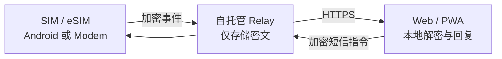

<div align="center">


# SIM Hub

**将 Android 手机与受支持的蜂窝 Modem 变成私有、自托管的短信和 SIM 管理中心。**

多 SIM 收发短信 · 验证码提取 · 加密中继 · Web / PWA 管理

[**简体中文**](README.zh-CN.md) · [English](README.md)

[](https://github.com/blackkcold/simhub/actions/workflows/ci.yml)
[](https://github.com/blackkcold/simhub/releases/latest)
[](LICENSE)

**[下载 Android APK](https://github.com/blackkcold/simhub/releases/latest)** · **[部署教程](docs/QUICKSTART.zh-CN.md)** · [安装说明](docs/INSTALLATION.md)

</div>

## 界面预览

**Web / PWA · 短信会话与直接回复**


**Web / PWA · 设备、SIM 与诊断管理**


<table>
<tr><th>手机端 Web / PWA</th><th>Android SIM Node</th></tr>
<tr><td width="50%"></td><td width="50%"></td></tr>
</table>

**Android 折叠屏展开态 · 双栏短信工作区**


<sub>均为依据当前 UI 绘制的模拟数据示意图，非真实短信或已登录设备截图。</sub>

## 在线更新

Web「设置 → 系统版本」支持 GitHub Release 检测、忽略及一键部署**经 Sigstore 签名验证、Digest 固定的 GHCR 镜像**。须先迁移至 **Rootless Docker**，安装可信 Cosign，并由专用非 root 用户执行 `bash scripts/install-updater.sh`。旧 root 更新服务须停用。Web 容器不接触 Docker Socket；升级前备份 SQLite，健康检查失败回滚上一镜像。详情见[迁移说明](docs/DEPLOYMENT.md)。Android「设置 → 高级工具」支持检查更新、忽略版本、自动下载与通过系统确认安装签名 APK。参见 [部署](docs/DEPLOYMENT.md) 与 [Android](docs/ANDROID_SETUP.md) 指南。

## 核心功能

| 能力 | 说明 |
|---|---|
| **短信与验证码** | 无需接管系统信息的伴随模式，或可选完整默认短信模式；多 SIM 收发与 OTP 识别（Android 17 非默认模式可能延迟验证码） |
| **Android 原生界面** | 唯一 Material 3 自适应四 Tab 界面，折叠屏双栏、SIM 标签、完整高级工具与脱敏诊断 |
| **设备与 SIM** | Android / Linux 蜂窝 Modem 节点；SIM 号码、信号、充电、Wi-Fi 与在线状态 |
| **共享短信池（主动开启）** | 已授权的 Android 设备通过加密共享池同步短信，最近 100 条、分页及来源 SIM 尾号 |
| **历史与诊断** | 最近 100 条重扫、更早 100 条分批同步、Web 滚动自动分页、脱敏健康诊断 |
| **设备配对** | 设备页三步向导支持「扫码或复制注册链接」及「复制节点地址 + 八位配对码」，核验指纹后授权 |
| **隐私与登录** | Node Key 端到端加密、用户名 / TOTP / Passkey、Vault 活动会话刷新恢复 |
| **离线恢复** | 本地队列、断网后重试、常驻中继、后台任务恢复 |

Android 矢量图标原始 SVG 位于 [design/icons](design/icons)，APK 使用同路径的 Android VectorDrawable，并在 CI 中校验一致性。

## 工作原理



## 一键部署

需要 **Linux + Docker Compose + Python 3**、两个指向服务器的 DNS 域名（例如 `admin.example.com`、`node.example.com`）及 TCP **80/443**。不向公网开放 **8787**。

```bash
git clone https://github.com/blackkcold/simhub.git
cd simhub
python3 scripts/setup.py --admin-domain admin.example.com --node-domain node.example.com
```

向导检查 DNS / Docker / 端口，生成管理员 Token、TOTP、私有 `.env`，部署 Relay 与 Caddy HTTPS；**DNS 记录需自行在域名服务商处设置**。已有 Nginx / Caddy / Traefik 时，给命令增加 `--mode external` 并自行配置双域名 HTTPS 反代。

然后打开管理域名，登录并创建/导入本地 Vault；下载正式签名 APK，通过扫码或 Android 发码完成配对并授权读取、接收和发送短信；**不必将 SIM Hub 设置为默认短信应用**，完整接管模式为可选项。

## 系统兼容实验室（v0.12.0）

Android App 的「设置 → 系统兼容实验室」是**独立的高级可选页面**：支持官方 Shizuku SDK 分步授权和服务状态检测、Android 13+ 自管理 Companion Device 系统确认关联、机型及系统 SDK 检测、短信权限和只读 OTP AppOp 查询、单次 SMS Provider 探测、近期加密补扫，以及针对 vivo/OPPO 等设备的电池优化设置入口。高级操作记录为独立的脱敏审计日志，可在诊断 ZIP 中导出。**不自动停用系统短信、关闭验证码安全保护或修改敏感 AppOps。Shizuku/CDM 不保证实时 OTP。**详见[系统兼容实验室](docs/COMPATIBILITY_LAB.md)。

## 短信同步故障诊断（v0.12.1）

Android「设置 → 运行与短信同步」显示待上传数、已上传回执、上次上传数量和失败原因；「系统兼容实验室」提供短信广播、Provider 变更、滚动补扫及 Relay ACK 的时间点。PWA 会提示无法解密的具体类别，并修复了旧时间短信新上传后被隐藏的问题。**队列 0 可能代表已经上传并确认；原 Vault / Node Key 丢失时，不能靠服务器还原密文。请勿为了排障删除原始短信或重置配对。**详情：[排障手册](docs/COMPATIBILITY_LAB.md)。

## 非默认短信模式

在系统允许授权 `READ_SMS`、`RECEIVE_SMS` 与 `SEND_SMS` 的情况下，SIM Hub 可以保持 vivo 等原厂「信息」为默认应用，通过 `SMS_RECEIVED` 广播触发系统短信数据库的加密同步，并通过 6 小时滚动补扫恢复延迟可见的短信。**Android 17 对部分非默认应用的受保护验证码有约 3 小时访问延迟**，本项目不绕过系统保护；厂商 ROM 和安装来源也可能限制短信权限。需要实时获取所有验证码时，此模式不能保证满足要求。详见 [Android 设置](docs/ANDROID_SETUP.md)。

## 使用边界

Relay 无法读取短信和 Vault 明文；Passkey 用于认证，不代替 Vault 恢复密钥。活动会话默认 **8 小时无操作过期、24 小时绝对到期**，同一标签页刷新可恢复解锁状态。移动数据回退由 Android 使用**系统预设的默认数据 SIM**，普通 APK 无法强制切换数据卡。**不提供电话功能；MMS 媒体收发不完整。**

## 文档

[一键部署](docs/QUICKSTART.zh-CN.md) · [完整安装](docs/INSTALLATION.md) · [Android 设置](docs/ANDROID_SETUP.md) · [安全设计](docs/SECURITY_ARCHITECTURE.md) · [共享短信](docs/SHARED_SMS.md) · [架构与协议](docs/ARCHITECTURE.md) · [开源协议](LICENSE)
