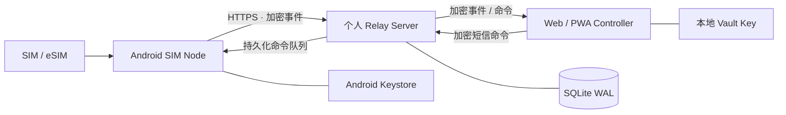

<div align="center">

# SIM Hub

**把 Android 手机变成私有、自托管的 SIM / 短信远程管理中心。**

使用你自己的服务器作为加密 Relay，在另一台设备上远程收短信、提取验证码、管理多张 SIM，并通过 Web/PWA 远程发送短信。

**简体中文** · [English](README.md)

[](https://github.com/blackkcold/simhub/actions/workflows/ci.yml)
[](https://github.com/blackkcold/simhub/releases/latest)
[](LICENSE)
[](docs/ANDROID_SETUP.md)
[](docs/DEPLOYMENT.md)

[下载最新版本](https://github.com/blackkcold/simhub/releases/latest) · [安装说明](docs/INSTALLATION.md) · [系统架构](docs/ARCHITECTURE.md) · [安全架构](docs/SECURITY_ARCHITECTURE.md)

</div>

---

## SIM Hub 是什么？

SIM Hub 是一个 **个人自用、自托管的 Android SIM / SMS 远程管理系统**。

一台或多台 Android 手机作为 **SIM Node**，插入实体 SIM / eSIM；你自己的服务器只承担 Relay、队列和设备控制平面；Web/PWA Controller 在本地完成短信内容解密、搜索、复制验证码和远程发送。

适合：

- 把一张或多张实体 SIM / eSIM 长期放在家里、机房或其他地点在线；
- 在另一台手机、平板或电脑上远程接收短信；
- 快速复制验证码 / OTP；
- 指定某台设备、某张 SIM 远程发送短信；
- 查看 SIM、运营商、信号、电量、网络和设备状态；
- 用一个私有控制台统一管理多台 Android SIM Node。

> **产品边界：** SIM Hub 只做 SIM / SMS 管理。项目明确**不包含**电话接听、拨号、Call Log、蜂窝通话音频、SIP/WebRTC 或 PSTN 音频桥接。

---

## 系统架构



### 信任边界

```text
Android SIM Node
  ├─ SMS / OTP / SIM 状态
  ├─ 本地持久化队列
  └─ AES-256-GCM 加密
             │
             ▼
个人 Relay Server
  ├─ 密文
  ├─ 路由元数据
  ├─ 设备 / 命令状态
  └─ 不持有 Vault Key
             │
             ▼
Web / PWA Controller
  └─ 本地解密 / 搜索 / 复制 / 发送
```

Relay 的设计目标就是**默认看不到短信明文**。Vault Key 在注册过程中由 Controller 与 Android Node 建立共享，正常运行时不会交给 Relay Server。

---

## 核心功能

| 模块 | 能力 |
|---|---|
| **SMS** | 接收短信、历史同步、远程发送、multipart 处理 |
| **OTP** | Android 端识别验证码；OTP 明文仍只存在于加密 Payload 内 |
| **多卡** | 双卡 / eSIM，按 Android `subscriptionId` 精确路由 |
| **远程控制** | 在 PWA 中选择设备 + SIM 发送短信 |
| **设备管理** | 多 Android Node、别名、设备分组、在线状态 |
| **状态监控** | 运营商、服务状态、信号、电量、充电、网络、Agent 状态 |
| **离线可靠性** | Android 本地持久化 Event Queue + Server Command Queue |
| **安全** | AES-256-GCM E2EE、按设备 HKDF 派生密钥、Android Keystore、Token Hash、元数据绑定、命令过期/幂等 |
| **Controller** | 可安装 PWA：Inbox、OTP复制、搜索、发短信、设备、诊断 |
| **认证** | 高强度 Admin Token + 可选 TOTP 登录，之后使用短时 HttpOnly Session |
| **通知** | 可选 Bark / ntfy / 自定义 Metadata-only Webhook |
| **运维** | Docker、Health Check、Audit、Backup、OTA Metadata |

### Android 兼容范围

- **minSdk：** Android 10 / API 29
- **targetSdk / compileSdk：** Android 17 / API 37
- 项目按真正的 **默认 SMS App** 路径设计，以适配现代 Android 对任意短信/OTP 的访问限制。
- 多卡路由基于 Android subscription ID，不把业务逻辑写死成 SIM1 / SIM2。

OEM 后台限制、保活和测试说明见 [Compatibility](docs/COMPATIBILITY.md)。

---

## 快速部署

### 1. 部署 Relay Server

```bash
git clone https://github.com/blackkcold/simhub.git
cd simhub

cp .env.example .env
python3 scripts/gen_admin_token.py
```

将生成的 Token 填入：

```env
SIMHUB_ADMIN_TOKEN=<你的随机 Token>
SIMHUB_PUBLIC_BASE_URL=https://simhub.example.com
```

启动：

```bash
docker compose up -d --build
curl http://127.0.0.1:8787/healthz
```

对公网只应通过 **HTTPS** 暴露 Relay，可使用 Caddy、Nginx 或 Traefik。

仓库已经提供 [Caddyfile.example](Caddyfile.example)。

### 2. 打开 Web / PWA Controller

通过浏览器访问你的 SIM Hub HTTPS 地址。

然后：

1. 输入 Admin Token；
2. 如已配置，输入 TOTP 创建短时 HttpOnly 浏览器 Session；
3. 创建、导入或解锁本地 Vault；
4. 生成一次性 Android Enrollment Link。

### 3. 安装 Android Agent

从下面下载最新 APK：

**[GitHub Releases →](https://github.com/blackkcold/simhub/releases/latest)**

v0.1.5 的发布流程会在仓库已配置稳定签名 Secrets 时生成正式签名 APK；若未配置，则会明确以 **debug-signed** 文件名发布。

在作为 SIM Node 的 Android 手机上：

1. 安装 APK；
2. 打开 PWA 生成的 Enrollment Link；
3. 完成设备注册；
4. 授予短信 / SIM 所需权限；
5. 将 SIM Hub 设置为 **默认短信 App**；
6. 如需要联系人名称映射，可额外授予 Contacts 权限；
7. 如果需要尽可能低延迟的远程访问，启用 Always-on Relay。

完整流程见 [安装说明](docs/INSTALLATION.md)。

---

## 安装与使用流程

### 第一次安装

```text
1. 部署 Relay Server
        ↓
2. 配置 HTTPS + SIMHUB_PUBLIC_BASE_URL
        ↓
3. 浏览器打开 Web / PWA Controller
        ↓
4. 创建 / 解锁本地 Vault
        ↓
5. 生成一次性 Enrollment Link
        ↓
6. Android 手机安装 Agent
        ↓
7. 注册为 SIM Node
        ↓
8. 设置 SIM Hub 为默认短信 App
        ↓
9. 授予 SMS / SIM 所需权限
        ↓
10. 按需开启 Always-on Relay
```

完成后，这台 Android 手机就成为一个长期在线的 **SIM Node**。日常通常不需要再直接操作这台手机，只需要保持手机有电、网络在线，并能正常接收运营商短信。

### 日常接收短信 / OTP

```text
运营商短信到达
    ↓
Android SIM Node 接收并写入本机短信库
    ↓
如为验证码，在 Android 本地识别 OTP
    ↓
Android 本地加密消息 Payload
    ↓
通过你的 Relay Server 转发密文
    ↓
PWA 拉取并在本地解密
    ↓
查看短信 / 一键复制验证码
```

实际使用时，只需要在电脑、平板或另一台手机打开 PWA。新的短信同步后会出现在 Inbox，识别出的 OTP 可以直接复制。

### 远程发送短信

```text
PWA 选择 Android 设备
    ↓
选择具体 SIM / subscription
    ↓
填写号码和短信
    ↓
PWA 本地加密命令
    ↓
Relay Server 持久化排队
    ↓
Android SIM Node 拉取命令
    ↓
指定 SIM 发送短信
    ↓
发送结果回传 Controller
```

Relay Server 不需要获得短信正文明文，也能完成命令中转。

### Android 手机暂时离线时

系统不依赖“WebSocket 永远在线”。Event 和 Command 都会先进入持久化队列；手机恢复网络后会继续同步。因此短暂断网、Wi-Fi 切换或后台进程被系统回收，不应直接造成短信业务状态丢失。

如果希望验证码尽可能实时到达 Controller，建议开启 Android Agent 的 **Always-on Relay**，并在 vivo / OPPO / Xiaomi / HONOR / Huawei 等系统中按需关闭该 App 的激进省电限制、允许自启动。

### 增加更多 SIM Node

每增加一台 Android 手机，只需重新生成一次性 Enrollment Link 并重复注册流程。每个 Node 都有独立设备身份和 Token；之后可在 PWA 中选择目标设备及对应 Android subscription 来收发短信。

---

## 安全模型

SIM Hub 将短信和 OTP 按“认证基础设施”级别的数据处理。

核心原则：

- SMS 正文、OTP、联系人名称、远程发送的号码与内容在进入 Relay 前加密；
- Relay 不保存 Vault Key；
- Device Bearer Token 在 Server 端只保存 Hash；
- Enrollment Token 短时有效且单次使用；
- Remote Command 具有过期和幂等保护；
- Server 日志与通知 Webhook 不记录短信正文和 OTP；
- Android 本地密钥由 Android Keystore 保护；
- 对公网访问必须使用 TLS / HTTPS。

详细设计：

- [安全架构](docs/SECURITY_ARCHITECTURE.md)
- [威胁模型](THREAT_MODEL.md)
- [安全策略](SECURITY.md)

---

## 可靠性设计

SIM Hub 不假设 Android 后台进程或 WebSocket 永远在线。

而是采用：

```text
收到短信
  → 本地先持久化
  → 加密
  → 进入 Durable Queue
  → 网络恢复后上传

远程命令
  → Relay 先持久化
  → Android 拉取
  → 校验过期 / 幂等
  → 执行
  → 回传结果
```

因此临时移动网络断开、Wi-Fi 切换、进程被回收或 Relay 暂时不可达，不会被简单等同为业务数据丢失。

---

## v0.1.5 可靠性升级

- Event ID 改为按设备作用域唯一，多台 Android 可以安全出现相同 SMS Provider ID。
- Android 对 Remote Command 先做 SQLite 原子 Claim，所有同步入口共用单进程协调锁，降低重复发短信风险。
- SMS History 使用 `(date, providerId)` 双游标，只有成功进入本地 Durable Queue 后才推进。
- 短信发送状态明确跟踪为 `submitted → sent → delivered` 或 `failed`。
- 新密文按设备使用 HKDF 派生 AES-256-GCM Key，带 `kid` 并把不可变元数据纳入 AAD；旧 v1 密文保持兼容。
- Admin Token + TOTP 只在登录时换取短时 HttpOnly Session，不再每次轮询重复使用旧 TOTP。
- PWA 增加 Recovery Key 导入与 SSE 实时刷新，轮询仅作兜底。
- 新短信通知增加新鲜度/OTP/设备过滤，历史同步不会刷屏。
- 增加数据库自动迁移、Subscription 投影、密文保留期、Metrics、在线备份脚本和滚动升级兼容。

---

## 当前限制

### 不做电话模块

项目明确不包含：

- 电话接听 / 拒接；
- 远程拨号；
- 通话记录；
- 蜂窝电话音频抓取；
- SIP / RTP / WebRTC；
- PSTN 媒体桥接。

### MMS

当前包含成为 Default SMS Handler 所需能力，以及 **MMS Metadata / History Observation**，但没有实现完整、跨运营商可靠的 MMS PDU 下载 / 发送协议栈。

当前生产路径仍是 SMS / OTP。

### APK 签名

公开 Release 中的 APK 可能是 Debug 签名，除非 Release 特别标明。长期个人使用建议从源码使用自己的 Release Signing Key 构建并签名。

---

## 文档导航

| 文档 | 内容 |
|---|---|
| [安装说明](docs/INSTALLATION.md) | Server + PWA + Android 全流程安装 |
| [系统架构](docs/ARCHITECTURE.md) | 组件、信任边界、数据流 |
| [Android Setup](docs/ANDROID_SETUP.md) | Android 构建与设备要求 |
| [Relay Server](docs/SERVER.md) | Server 运行时、配置和职责 |
| [部署说明](docs/DEPLOYMENT.md) | Docker、HTTPS、备份、OTA |
| [Protocol](docs/PROTOCOL.md) | Enrollment、Event、Command 协议 |
| [安全架构](docs/SECURITY_ARCHITECTURE.md) | 加密和 Trust Model |
| [兼容性](docs/COMPATIBILITY.md) | Android / OEM 行为和测试说明 |

---

## 从源码构建

### Server

Relay 尽量保持轻量，使用 Python Standard Library + SQLite。

```bash
export SIMHUB_ADMIN_TOKEN="$(python3 scripts/gen_admin_token.py --raw)"
export SIMHUB_DB=/tmp/simhub.db
python3 server/simhub_server.py
```

### Android

需要：

- JDK 17
- Android SDK Platform 37
- Gradle 9.6+

```bash
cd android
gradle :app:assembleDebug
```

GitHub Actions CI 同样会执行完整的 Android API 37 Debug APK 构建验证。

---

## Release

当前版本：

**[v0.1.5 — Reliability & Security](https://github.com/blackkcold/simhub/releases/tag/v0.1.5)**

Release 中包含 Android APK、对应 Tag 的源码快照、文档包以及 SHA-256 校验文件。

---

## License

SIM Hub 使用 [MIT License](LICENSE)。

平台与工具相关声明见 [THIRD_PARTY_NOTICES.md](THIRD_PARTY_NOTICES.md)。
