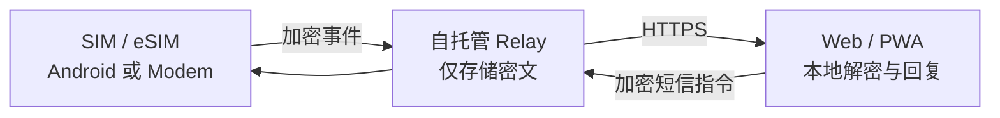

<div align="center">


# SIM Hub

**将 Android 手机与受支持的蜂窝 Modem 变成私有、自托管的短信和 SIM 管理中心。**

多 SIM 收发短信 · 验证码提取 · 加密中继 · Web / PWA 管理

[**简体中文**](README.zh-CN.md) · [English](README.md)

[](https://github.com/blackkcold/simhub/actions/workflows/ci.yml)
[](https://github.com/blackkcold/simhub/releases/latest)
[](LICENSE)

**[下载 Android APK](https://github.com/blackkcold/simhub/releases/latest)** · **[部署教程](docs/QUICKSTART.zh-CN.md)** · [安装说明](docs/INSTALLATION.md)

</div>

## 界面预览

**Web / PWA · 短信会话与直接回复**


**Web / PWA · 设备、SIM 与诊断管理**


<table>
<tr><th>手机端 Web / PWA</th><th>Android SIM Node</th></tr>
<tr><td width="50%"></td><td width="50%"></td></tr>
</table>

<sub>均为依据当前 UI 绘制的模拟数据示意图，非真实短信或已登录设备截图。</sub>

## 核心功能

| 能力 | 说明 |
|---|---|
| **短信与验证码** | 多 SIM 收发、会话直接回复、新建短信、OTP 识别与复制 |
| **Android 原生界面** | 四 Tab（概览 / 短信 / SIM / 设置）、矢量图标与动效、折叠屏自适应单双栏、本机短信会话与快捷回复 |
| **设备与 SIM** | Android / Linux 蜂窝 Modem 节点；SIM 号码、信号、充电、Wi-Fi 与在线状态 |
| **历史与诊断** | 最近 100 条重扫、每批更早 100 条同步、已同步记录分页、加密设备健康检查 |
| **设备配对** | 管理中心生成二维码扫码接入；Android 也可生成八位配对码，在管理中心核验设备指纹后授权 |
| **隐私与登录** | Node Key 端到端加密、用户名 / TOTP / Passkey、Vault 活动会话刷新恢复 |
| **离线恢复** | 本地队列、断网后重试、常驻中继、后台任务恢复 |

Android 矢量图标原始 SVG 位于 [design/icons](design/icons)，APK 使用同路径的 Android VectorDrawable，并在 CI 中校验一致性。

## 工作原理



## 一键部署

需要 **Linux + Docker Compose + Python 3**、两个指向服务器的 DNS 域名（例如 `admin.example.com`、`node.example.com`）及 TCP **80/443**。不向公网开放 **8787**。

```bash
git clone https://github.com/blackkcold/simhub.git
cd simhub
python3 scripts/setup.py --admin-domain admin.example.com --node-domain node.example.com
```

向导检查 DNS / Docker / 端口，生成管理员 Token、TOTP、私有 `.env`，部署 Relay 与 Caddy HTTPS；**DNS 记录需自行在域名服务商处设置**。已有 Nginx / Caddy / Traefik 时，给命令增加 `--mode external` 并自行配置双域名 HTTPS 反代。

然后打开管理域名，登录并创建/导入本地 Vault；下载正式签名 APK，通过扫码或 Android 发码完成配对、短信权限和**默认短信应用**设置。

## 使用边界

Relay 无法读取短信和 Vault 明文；Passkey 用于认证，不代替 Vault 恢复密钥。活动会话默认 **8 小时无操作过期、24 小时绝对到期**，同一标签页刷新可恢复解锁状态。移动数据回退由 Android 使用**系统预设的默认数据 SIM**，普通 APK 无法强制切换数据卡。**不提供电话功能；MMS 媒体收发不完整。**

## 文档

[一键部署](docs/QUICKSTART.zh-CN.md) · [完整安装](docs/INSTALLATION.md) · [Android 设置](docs/ANDROID_SETUP.md) · [安全设计](docs/SECURITY_ARCHITECTURE.md) · [架构与协议](docs/ARCHITECTURE.md) · [开源协议](LICENSE)
