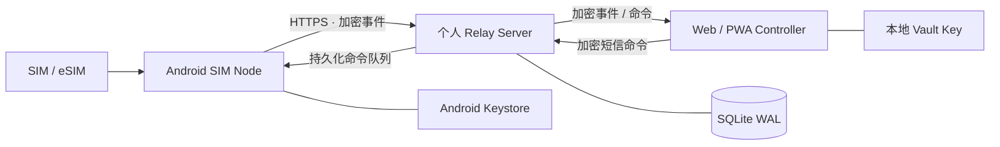

<div align="center">


# SIM Hub

**把 Android 手机和受支持的蜂窝 Modem 变成私有、自托管的 SIM / 短信远程管理中心。**

使用你自己的服务器作为加密 Relay，在另一台设备上远程收短信、提取验证码、管理多张 SIM，并通过 Web/PWA 远程发送短信。

**简体中文** · [English](README.md)

[](https://github.com/blackkcold/simhub/actions/workflows/ci.yml)
[](https://github.com/blackkcold/simhub/releases/latest)
[](LICENSE)
[](docs/ANDROID_SETUP.md)
[](docs/DEPLOYMENT.md)

[下载最新版本](https://github.com/blackkcold/simhub/releases/latest) · [安装说明](docs/INSTALLATION.md) · [系统架构](docs/ARCHITECTURE.md) · [安全架构](docs/SECURITY_ARCHITECTURE.md)

</div>

---

## 界面预览

Web 控制台提供响应式桌面/手机布局，Android Agent 则使用原生界面。两端共享统一 Logo 与品牌配色，并支持浅色、深色主题。

> **预览说明：** 以下是依据当前界面结构绘制的**示意图**，使用脱敏的演示内容，并非已登录真实服务器的截图或功能验收结果。具体展示会随设备尺寸、语言及实际数据变化。

**Web / PWA · 桌面端**

<p align="center"></p>

<table>
<tr><th>Web / PWA · 手机端</th><th>Android SIM Node · 原生界面</th></tr>
<tr><td width="50%"></td><td width="50%"></td></tr>
</table>

**开始使用：** [下载 APK](https://github.com/blackkcold/simhub/releases/latest) → [部署个人 Relay](docs/DEPLOYMENT.md) → [打开 HTTPS 管理控制台并注册 SIM 节点](docs/INSTALLATION.md)。UI 规范与资产位置见 [Design System](docs/DESIGN_SYSTEM.md)。

---

## SIM Hub 是什么？

SIM Hub 是一个 **个人自用、自托管的多节点 SIM / SMS 远程管理系统**。

一台或多台 Android 手机，以及受支持的 Linux / DJI / USB 蜂窝 Modem 作为 **SIM Node**；你自己的服务器只承担 Relay、队列和设备控制平面；Web/PWA Controller 在本地完成短信内容解密、搜索、复制验证码和远程发送。

适合：

- 把一张或多张实体 SIM / eSIM 长期放在家里、机房或其他地点在线；
- 在另一台手机、平板或电脑上远程接收短信；
- 快速复制验证码 / OTP；
- 指定某台设备、某张 SIM 远程发送短信；
- 查看 SIM、运营商、信号、电量、网络和设备状态；
- 用一个私有控制台统一管理多台 Android 与 Linux/DJI Modem SIM Node。

> **产品边界：** SIM Hub 只做 SIM / SMS 管理。项目明确**不包含**电话接听、拨号、Call Log、蜂窝通话音频、SIP/WebRTC 或 PSTN 音频桥接。

---

## 系统架构



### 信任边界

```text
Android SIM Node
  ├─ SMS / OTP / SIM 状态
  ├─ 本地持久化队列
  └─ AES-256-GCM 加密
             │
             ▼
个人 Relay Server
  ├─ 密文
  ├─ 路由元数据
  ├─ 设备 / 命令状态
  └─ 不持有 Vault Key
             │
             ▼
Web / PWA Controller
  └─ 本地解密 / 搜索 / 复制 / 发送
```

Relay 的设计目标就是**默认看不到短信明文**。新节点注册时由 Controller 生成独立 Node Key，Master Vault Key 不再下发到节点；Relay 仅保存被 Master Vault 加密包裹的 Node Key envelope 与密文/路由元数据。旧 v0.1.5 节点可在线旋转到独立 Node Key。

---


## 最新两轮升级：v0.4.0 → v0.5.0

| 版本 | 用户可见变化 | 使用入口 |
|---|---|---|
| **v0.4.0** | 双域名部署向导、Caddy HTTPS、用户名与 Passkey、短信会话和直接回复、移动端界面间距优化 | 安装向导；**设置 → 通行密钥**；**短信 → 选择会话 / + 新建短信** |
| **v0.5.0** | 刷新页面自动恢复活动 Vault、设备/SIM 号码与充电/Wi-Fi 状态、双向每批 100 条同步、远程诊断结果、默认数据 SIM 回退指引 | **设备** 卡片；**设置号码**；**同步最近/更早 100 条**；**诊断**；**备用数据 SIM** |

**登录与隐私：** 管理员 Session 默认空闲 **8 小时**、绝对有效期 **24 小时**；Vault 使用同一活动空闲期限。**同一标签页**刷新会先验证管理员会话，再恢复本地加密 Vault 快照；主动锁定、退出或会话到期后不能免密恢复。关闭标签页、换设备或清空站点数据后仍可能需要 Vault 密码。Passkey 用于管理员登录与敏感操作确认，**不等于 Vault 解锁**。

**SIM 号码：** Android 可读取的号码通过 Node Key 加密上传；无法读取时，在 Web **设备 → 设置号码**中补录。该覆盖值只保存在**当前浏览器**的 Vault 加密存储中，不会自动同步至其他控制端；SIM 更换后应重新核对号码。

**短信数量的三个概念不可混淆：** “同步最近 100 条”让 Android 重扫手机最新短信；“同步更早 100 条”以独立游标追溯旧短信；收件箱“加载更早短信”只分页查看**已上传 Relay** 的记录（首屏按 30 条加载）。同步指令已入队≠短信全部上传完成。旧 Agent 需要先升级到 v0.5.0 才能执行最新 100 条重扫。

**网络接管边界：** Wi-Fi 断开时由 Android 使用**系统事先选定、已启用移动数据的默认数据 SIM**。SIM Hub 无法以普通 APK 权限强制切换默认数据卡；Web 的“备用数据 SIM”用于登记与检查策略，手机端有**打开移动数据 / 默认数据卡设置**入口。详见 [Android 兼容说明](docs/COMPATIBILITY.md)。

## 核心功能

| 模块 | 能力 |
|---|---|
| **SMS** | 接收短信、历史同步、远程发送、multipart 处理 |
| **OTP** | Android 端识别验证码；OTP 明文仍只存在于加密 Payload 内 |
| **多卡 / Modem** | 使用稳定的 `channelId + revision` 统一路由 Android subscription 与 Linux/DJI Modem SIM |
| **远程控制** | 在 PWA 中选择设备 + SIM 发送短信 |
| **设备管理** | 多 Android Node、别名、设备分组、在线状态 |
| **状态监控** | 运营商、服务状态、信号、电量、充电、网络、Agent 状态 |
| **离线可靠性** | Android 本地持久化 Event Queue + Server Command Queue |
| **安全** | AES-256-GCM E2EE、独立 Node Key、Android Keystore/受保护 Modem 配置、AAD 元数据绑定、两阶段 Device Token 轮换 |
| **Controller** | 可安装 PWA：Inbox、OTP复制、搜索、发短信、设备、诊断 |
| **中文与响应式 UI** | Android + Web/PWA 支持简体中文 / English；Android 可跟随系统语言，并适配手机、横屏、折叠屏展开态与平板 |
| **开发者诊断** | Android 可选开发者模式；日志自动脱敏短信正文、OTP、Token 与密钥，支持轮转、查看、清空和 ZIP 导出 |
| **认证** | 管理员用户名 + Admin Token/TOTP、FIDO2 Passkey；HttpOnly Session（空闲 8 小时、最长 24 小时）与活动 Vault 刷新恢复 |
| **通知** | 可选 Bark / ntfy / 自定义 Metadata-only Webhook |
| **运维** | Docker、Health Check、Audit、Backup、OTA Metadata |

### Android 兼容范围

- **minSdk：** Android 10 / API 29
- **targetSdk / compileSdk：** Android 17 / API 37
- 项目按真正的 **默认 SMS App** 路径设计，以适配现代 Android 对任意短信/OTP 的访问限制。
- 远程短信路由基于稳定 Channel ID 与 revision；Android `subscriptionId` 只作为本地适配器 ID，换卡后旧命令会被拒绝。

OEM 后台限制、保活和测试说明见 [Compatibility](docs/COMPATIBILITY.md)。

---


## 快速部署（v0.4.0 起推荐：引导式安装）

**准备：** Linux VPS/虚拟机、Docker Engine + Compose plugin、Python 3、可用的公网 IPv4，以及 `admin.example.com` / `node.example.com` 两个不同 HTTPS 域名。预先在 DNS 控制台为两个域名添加指向服务器的 **A 记录**；如存在 AAAA，请确保 IPv6 可达。入站开放 TCP **80/443**，**不要对公网开放 8787**。

### 1. 首次安装：托管 Caddy 与自动 HTTPS

```bash
git clone https://github.com/blackkcold/simhub.git
cd simhub
python3 scripts/setup.py \
  --admin-domain admin.example.com \
  --node-domain node.example.com
```

向导检查 Docker/Compose、DNS 和端口；自动生成**管理员高熵 Token、TOTP Secret**和权限为 0600 的 `.env`，生成 `Caddyfile`，并通过 Docker Compose 启动 Relay + Caddy。**不会自动修改 DNS 服务商记录**；`.env` 必须离线安全备份，不要提交 GitHub。

已有 Nginx、Caddy 或 Traefik 时改用：

```bash
python3 scripts/setup.py --mode external \
  --admin-domain admin.example.com \
  --node-domain node.example.com
```

此模式只准备/启动 Relay，**不会帮你配置现有代理**；需自行将两个域名 HTTPS 反代至 `127.0.0.1:8787`，正确重写 `X-Forwarded-For`，限制健康检查端点。DNS 尚未生效时用 `--skip-dns-check --no-start` 仅准备配置，完成解析后再 `--upgrade` 启动。详情：[中文一键部署](docs/QUICKSTART.zh-CN.md) · [部署与代理安全](docs/DEPLOYMENT.md)。

### 2. 初始化 Web Controller

浏览器打开 **`https://admin.example.com`**（不是 node 域名）：使用初始化**用户名**（默认 `admin`）、Admin Token 与 TOTP 建立管理员会话；随后创建/导入/解锁本地 Vault，并**离线备份 Recovery Key**。在 **设置 → 通行密钥**注册 Passkey 后，可用指纹/系统凭据登录，但 Vault 解锁仍由本地密钥机制控制。

Web 已将短信查看和发送整合为**会话收件箱 + 直接回复 + 右上角“+ 新建短信”**，设备页可看到 SIM 号码、电量、充电、网络、分批同步、诊断和网络策略。简体中文/English 与手机/桌面响应式 UI 均受支持。

### 3. 安装 Android Agent

[下载当前正式签名 APK（v0.5.0）](https://github.com/blackkcold/simhub/releases/tag/v0.5.0) 并在手机安装；通过控制端**添加设备**生成一次性注册链接，完成注册、授予短信及 SIM 权限、设为**默认短信应用**，再开启常驻 Relay。需要在断 Wi-Fi 后使用蜂窝数据时，先在 Android 系统中**打开移动数据并选择默认数据 SIM**。首次使用建议验证双卡收发及设备诊断。

APK 仅通过正式 Release 签名流程发布，指纹和 SHA-256 校验见 [签名说明](docs/RELEASE_SIGNING.md)。完整操作见 [安装手册](docs/INSTALLATION.md) 与 [Android 说明](docs/ANDROID_SETUP.md)。

### 4. 已有安装升级（保留密文、域名与密钥）

```bash
./scripts/backup.sh
git pull --ff-only
python3 scripts/setup.py --upgrade \
  --admin-domain admin.example.com \
  --node-domain node.example.com
```

如使用现有代理，升级时继续指定 `--mode external`。升级**不会覆盖**已有 `.env`、Caddyfile 或数据库；管理域名与 Passkey RP ID 绑定，不应随意更换。**先更新 Relay/PWA，再逐台安装新 APK**；旧节点无需重注册。升级指南：[v0.4–v0.5 升级与操作](docs/UPGRADE_0.4_TO_0.5.md)。

## 安装与使用流程

### 第一次安装

```text
1. 部署 Relay Server
        ↓
2. 配置 HTTPS + SIMHUB_PUBLIC_BASE_URL
        ↓
3. 浏览器打开 Web / PWA Controller
        ↓
4. 创建 / 解锁本地 Vault
        ↓
5. 生成一次性 Bootstrap Enrollment Link
        ↓
6. Android 手机安装 Agent
        ↓
7. 注册为 SIM Node
        ↓
8. 设置 SIM Hub 为默认短信 App
        ↓
9. 授予 SMS / SIM 所需权限
        ↓
10. 按需开启 Always-on Relay
```

完成后，这台 Android 手机就成为一个长期在线的 **SIM Node**。日常通常不需要再直接操作这台手机，只需要保持手机有电、网络在线，并能正常接收运营商短信。

### 日常接收短信 / OTP

```text
运营商短信到达
    ↓
Android SIM Node 接收并写入本机短信库
    ↓
如为验证码，在 Android 本地识别 OTP
    ↓
Android 本地加密消息 Payload
    ↓
通过你的 Relay Server 转发密文
    ↓
PWA 拉取并在本地解密
    ↓
查看短信 / 一键复制验证码
```

实际使用时，只需要在电脑、平板或另一台手机打开 PWA。新的短信同步后会出现在 Inbox，识别出的 OTP 可以直接复制。

### 远程发送短信

```text
PWA 选择 Android 设备
    ↓
选择具体 SIM / subscription
    ↓
填写号码和短信
    ↓
PWA 本地加密命令
    ↓
Relay Server 持久化排队
    ↓
Android SIM Node 拉取命令
    ↓
指定 SIM 发送短信
    ↓
发送结果回传 Controller
```

Relay Server 不需要获得短信正文明文，也能完成命令中转。

### Android 手机暂时离线时

系统不依赖“WebSocket 永远在线”。Event 和 Command 都会先进入持久化队列；手机恢复网络后会继续同步。因此短暂断网、Wi-Fi 切换或后台进程被系统回收，不应直接造成短信业务状态丢失。

如果希望验证码尽可能实时到达 Controller，建议开启 Android Agent 的 **Always-on Relay**，并在 vivo / OPPO / Xiaomi / HONOR / Huawei 等系统中按需关闭该 App 的激进省电限制、允许自启动。

### 增加更多 SIM Node

每增加一台 Android 或 Linux Modem 节点，都重新生成一次性 Enrollment Package。每个 Node 都有独立设备身份、Bearer Token 与独立 Node Key；PWA 统一选择 SMS Channel，因此 Android subscription 与 DJI/USB Modem SIM 共用同一 Inbox/发送流程。

---

## Linux / DJI Modem Node

仓库新增 `modem_agent/` Linux Modem Agent 对第一代 DJI/QDC507 采用直接 Quectel AT 串口控制，并保留通用 ModemManager/`mmcli` 路径。它具备本地 durable queue、短信收发、无线指标、SIM 更换 revision 与和 Android 一致的 E2EE 协议。

在 PWA 中创建 **Linux / DJI Modem Node** Enrollment Package，然后按 `modem_agent/README.md` 部署。DJI Cellular Dongle 2 不假定兼容，先通过 ModemManager/硬件能力检测，再决定 adapter。

---

## 安全模型

SIM Hub 将短信和 OTP 按“认证基础设施”级别的数据处理。

核心原则：

- SMS 正文、OTP、联系人名称、远程发送的号码与内容在进入 Relay 前加密；
- Relay 不保存 Vault Key；
- Device Bearer Token 在 Server 端只保存 Hash；
- Enrollment Token 短时有效且单次使用；
- Remote Command 具有过期和幂等保护；
- Server 日志与通知 Webhook 不记录短信正文和 OTP；
- Android 本地密钥由 Android Keystore 保护；
- 对公网访问必须使用 TLS / HTTPS。

详细设计：

- [安全架构](docs/SECURITY_ARCHITECTURE.md)
- [威胁模型](THREAT_MODEL.md)
- [安全策略](SECURITY.md)

---

## 可靠性设计

SIM Hub 不假设 Android 后台进程或 WebSocket 永远在线。

而是采用：

```text
收到短信
  → 本地先持久化
  → 加密
  → 进入 Durable Queue
  → 网络恢复后上传

远程命令
  → Relay 先持久化
  → Android 拉取
  → 校验过期 / 幂等
  → 执行
  → 回传结果
```

因此临时移动网络断开、Wi-Fi 切换、进程被回收或 Relay 暂时不可达，不会被简单等同为业务数据丢失。

---

## v0.2.1 生产加固

- 新节点使用真正独立的 Node Key；Master Vault Key 不再离开 Controller。
- 引入 Generic Node + Channel 模型，统一 Android 与 Linux/DJI Modem。
- Live SMS 入队失败后自动从 Android SMS Provider reconciliation。
- Android 后台执行器共享化、Job 可取消、陈旧短信 callback 自动超时收敛。
- Multipart 短信按 part 幂等跟踪 sent/delivered/resultCode。
- 远程短信发送前校验稳定 channel identity/revision，防换卡后发错 SIM。
- Linux Modem Agent 支持 ModemManager 与 DJI/Quectel 直接 AT adapter，并加入 durable multipart 收件重组。
- 持续 retention/maintenance、可信反代 IP、readyz 与 Docker context 加固。
- Device Bearer Token 两阶段自动轮换，网络中断可恢复。
- CI 增加 v1→v4 migration、maintenance、Modem 加密/队列测试与 Android JVM 单测。

## v0.1.5 可靠性升级

- Event ID 改为按设备作用域唯一，多台 Android 可以安全出现相同 SMS Provider ID。
- Android 对 Remote Command 先做 SQLite 原子 Claim，所有同步入口共用单进程协调锁，降低重复发短信风险。
- SMS History 使用 `(date, providerId)` 双游标，只有成功进入本地 Durable Queue 后才推进。
- 短信发送状态明确跟踪为 `submitted → sent → delivered` 或 `failed`。
- 新密文按设备使用 HKDF 派生 AES-256-GCM Key，带 `kid` 并把不可变元数据纳入 AAD；旧 v1 密文保持兼容。
- Admin Token + TOTP 只在登录时换取短时 HttpOnly Session，不再每次轮询重复使用旧 TOTP。
- PWA 增加 Recovery Key 导入与 SSE 实时刷新，轮询仅作兜底。
- 新短信通知增加新鲜度/OTP/设备过滤，历史同步不会刷屏。
- 增加数据库自动迁移、Subscription 投影、密文保留期、Metrics、在线备份脚本和滚动升级兼容。

---

## 无人值守上线前的硬件验收 Gate

当前 CI 已覆盖 Server 数据库迁移/保留策略、Generic Node/Channel 协议、Modem Agent 加密与队列、Web 语法、Android JVM OTP 单测以及 Android API 37 APK 构建。但下面这些必须在真实硬件上验收，CI **不会伪装成已通过**：

- Android 17 真机默认 SMS App 收信与 OTP；
- Doze + OEM 电池策略下连续 24–72 小时恢复；
- 双卡收发与实体 SIM 换卡后的 Channel Revision 拒绝旧命令；
- vivo / OPPO / Xiaomi / Huawei / HONOR 的重启、自启动与后台限制；
- DJI Gen1 / QDC507 真机短信收发与 Modem 短信存储清理；
- DJI Cellular Dongle 2 在实际硬件确认能力后才启用对应 Adapter。

详见 [Compatibility](docs/COMPATIBILITY.md)。

---

## 当前限制

### 不做电话模块

项目明确不包含：

- 电话接听 / 拒接；
- 远程拨号；
- 通话记录；
- 蜂窝电话音频抓取；
- SIP / RTP / WebRTC；
- PSTN 媒体桥接。

### MMS

现在会将收到的 MMS WAP PUSH 原始数据加密保存在本机并发出提示，但**仍不支持完整跨运营商 MMS 图片/媒体下载**。如果日常需要 MMS，请勿在主力手机上将其设为默认短信应用。

当前生产路径仍是 SMS / OTP。

### APK 签名

v0.2.1 起 Release workflow 强制使用固定长期签名身份；缺少 Secret 或证书 SHA-256 指纹不匹配都会直接阻止发版。

---

## 文档导航

| 文档 | 内容 |
|---|---|
| [两轮升级与 UI 操作指南](docs/UPGRADE_0.4_TO_0.5.md) | v0.4/v0.5 变更、迁移、登录、SIM、历史同步与诊断 |
| [一键部署（中文）](docs/QUICKSTART.zh-CN.md) | DNS、Caddy 托管、外部代理、无损升级 |
| [安装说明](docs/INSTALLATION.md) | Server + PWA + Android 全流程安装 |
| [系统架构](docs/ARCHITECTURE.md) | 组件、信任边界、数据流 |
| [Android Setup](docs/ANDROID_SETUP.md) | Android 构建与设备要求 |
| [Relay Server](docs/SERVER.md) | Server 运行时、配置和职责 |
| [部署说明](docs/DEPLOYMENT.md) | Docker、HTTPS、备份、OTA |
| [Protocol](docs/PROTOCOL.md) | Enrollment、Event、Command 协议 |
| [安全架构](docs/SECURITY_ARCHITECTURE.md) | 加密和 Trust Model |
| [兼容性](docs/COMPATIBILITY.md) | Android / OEM 行为和测试说明 |
| [视觉与 UI 规范](docs/DESIGN_SYSTEM.md) | 品牌图标、响应式布局及预览资产说明 |

---

## 从源码构建

### Server

Relay 尽量保持轻量，采用 Python、SQLite 和 WebAuthn 验签依赖。

```bash
export SIMHUB_ADMIN_TOKEN="$(python3 scripts/gen_admin_token.py --raw)"
export SIMHUB_DB=/tmp/simhub.db
python3 server/simhub_server.py
```

### Android

需要：

- JDK 17
- Android SDK Platform 37
- Gradle 9.6+

```bash
cd android
gradle :app:assembleDebug
```

GitHub Actions CI 同样会执行完整的 Android API 37 Debug APK 构建验证。

---

## Release

最新版本入口：

**[查看最新 GitHub Release](https://github.com/blackkcold/simhub/releases/latest)**

Release 中包含 Android APK、对应 Tag 的源码快照、文档包以及 SHA-256 校验文件。

---

## License

SIM Hub 使用 [MIT License](LICENSE)。

平台与工具相关声明见 [THIRD_PARTY_NOTICES.md](THIRD_PARTY_NOTICES.md)。
 
## 公网管理端安全加固（v0.3.1）

建议将管理 PWA 和 Android/DJI 节点 API 配置为两个独立 HTTPS 域名，管理域名再启用身份网关与独立 MFA。Relay 已加入 CSRF 防护、短时二次认证、服务端会话空闲失效、资源限制及设备端短信发送配额。**开启严格域名隔离前，必须先迁移已部署节点，避免中断短信同步。**部署顺序、验收及安全边界详见 [公网加固与迁移指南](docs/PUBLIC_SECURITY_HARDENING.md)。


## 高性能短信历史同步（v0.3.2）

- **首次注册**：Android 默认仅将**最近 100 条短信**加入同步队列，不再从几千条旧短信开始扫描。
- **日常增量**：独立的短信日期 + Provider ID 游标，只处理新增短信。
- **更早历史**：在 Android 点击「加载更早的 100 条短信」，或在 Web 设备卡片点击「同步历史」；每次最多补录 100 条，可按需重复。
- **网络传输**：每批 20 条端到端加密事件，Relay 事务写入、逐条确认、幂等去重；429 按 Retry-After 延迟重试，本地未确认数据不删除。
- **Web 收件箱**：初始只加载最近 30 条服务器事件，点击「加载更早」分步获取，避免历史批量上传拖慢页面。

**升级顺序**：先升级至 v0.3.2 Relay，再更新 Android APK。旧版 Android 仍可通过原有单条事件接口运行。现有 Node Key、设备绑定及短信密文不需要重置。Relay 原有数据保留期限仍然适用，历史事件可能按策略被清理。
